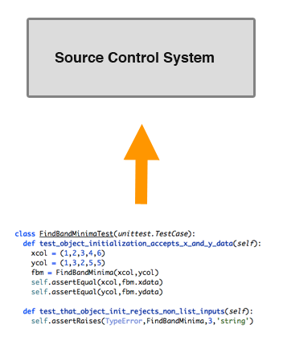
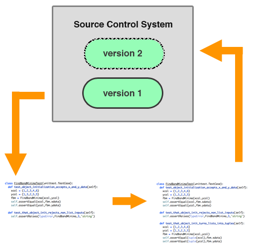
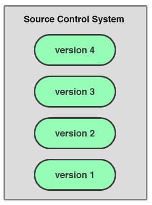
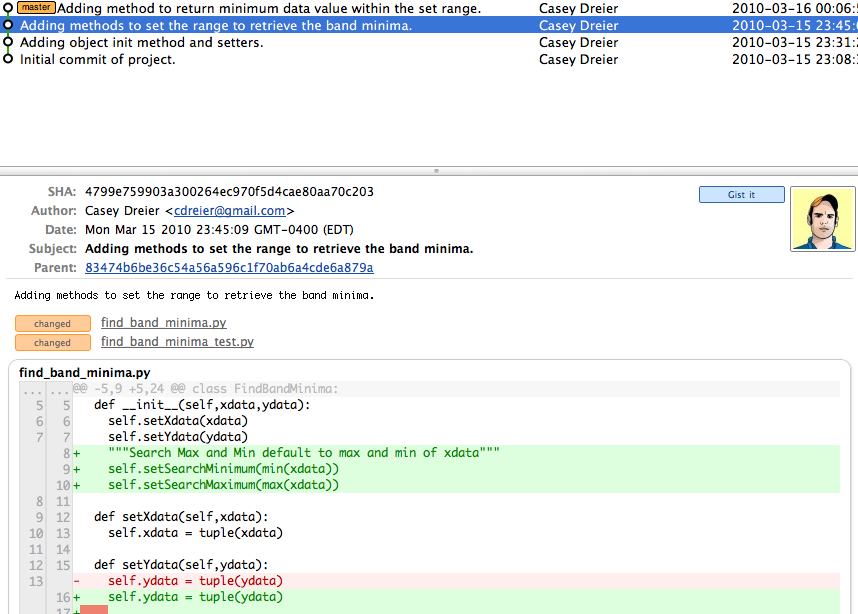
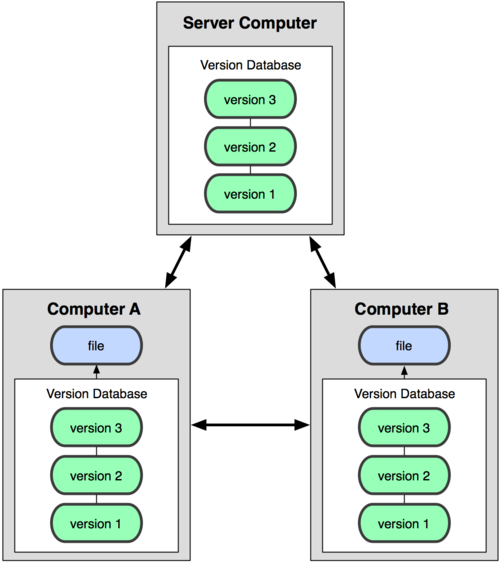

!SLIDE subsection
# Source Control #

!SLIDE
## "Nobody is teaching people how to do source control." - Eric Sink##

!SLIDE

# What is Source Control? #

!SLIDE

## Source control programs offer a structured system for tracking changes made to a project throughout its lifetime. ##

!SLIDE commandline incremental

##You've used source control before##

    $ cp mysweetcode.pro mysweetcode.ver1.pro
    
!SLIDE commandline incremental

## But this is untenable... ##
  
    $ ls -l code/
    -rw-------   1 cd  17192 Mar 16 21:38 mysweetcode.ver17.pro
    drwx------  19 cd    646 Mar 14 20:50 mysweetcode.ver9.pro
    drwx------  85 cd   2890 Mar 15 21:52 mysweetcode.ver10.pro
    drwx------  79 cd   2686 Mar 15 21:52 mysweetcode.ver11.pro
    drwxr-xr-x@ 41 cd   1394 Mar 17 21:28 mysweetcode.pro
    drwx------  46 cd   1564 Oct  9 15:56 mysweetcode.ver6.pro
    drwx------   4 cd    136 Jul  9  2009 mysweetcode.ver12.pro
    drwx------   6 cd    204 Apr 27  2008 mysweetcode.ver8.pro
    drwx------  13 cd    442 Feb 24 21:00 mysweetcode.orig.pro
    drwxr-xr-x   4 cd    136 Jan 30  2006 mysweetcode.ver7.pro
    drwxr-xr-x   5 cd    170 Jan 30  2006 mysweetcode.ver6.pro

!SLIDE
# There has *got* to be a better way... #

!SLIDE
## Enter SCM Systems ##

!SLIDE bullets
# Common SCM Functionality  #
* History Tracking
* Merging
* Branching
* Tagging
* Reverting

!SLIDE center

## Your Code Is Entered into a Repository ##

!SLIDE center

## When you change your code, you can _commit_ your changes back to the repository ##

!SLIDE center
## Over time, you develop an organized history of your code ##

!SLIDE

## Isn't that just like copying versions of your files? ##

!SLIDE bullets
# No! #

* You only ever have one "copy" of your code
* Works with directories and groups of files
* Every commit _must_ include a message describing what you're doing
* You can compare different versions easily

!SLIDE center

!SLIDE bullets
# Popular SCM Systems #

* CVS
* Subversion (SVN)
* Mercurial (Hg)
* Git

!SLIDE bullets
# Popular SCM Systems #

* <del>CVS</del>
* <del>Subversion (SVN)</del>
* __Mercurial (Hg)__
* __Git__

!SLIDE 
## Git and Hg are _distributed_ source control systems ##

!SLIDE center

## So Instead of This ##

!SLIDE center

## We Have This ##

!SLIDE bullets

# What This Means #

* With Distributed SCM, you don't need a server (sits on top of the file system)
* Don't need a connection to the internet
* Anyone who works with the code has the full history
* Remote repositories (GitHub)

!SLIDE bullets

# What this _Really_ means

* It's easy for you to set up

!SLIDE 

# So Why Should You Use Source Control? #

!SLIDE

## If for nothing else, it makes your life easier.  Really. ##

!SLIDE bullets
# Why? #

* Reminds you (and others!) what you did in a project and when
* Helps you share your code with other people (who might make it better)
* Allows you to confidently change your code knowing you can always revert back to a working version
