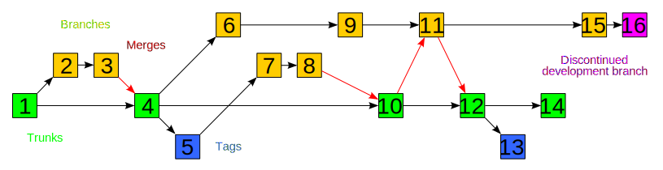

!SLIDE subsection
# Source Control #
###"Nobody is teaching people how to do source control." - Eric Sink###

!SLIDE commandline incremental

##You've used source control before##

    $ cp mysweetcode.py mysweetcode.py.backup
    
!SLIDE commandline incremental

## This usually doesn't work for very long ##
  
    $ ls -l code/
    -rw-------   1 cd  17192 Mar 16 21:38 mysweetcode.py.backup17
    drwx------  19 cd    646 Mar 14 20:50 mysweetcode.py.backup9
    drwx------  85 cd   2890 Mar 15 21:52 mysweetcode.py.backup10
    drwx------  79 cd   2686 Mar 15 21:52 mysweetcode.py.backup11
    drwxr-xr-x@ 41 cd   1394 Mar 17 21:28 mysweetcode.py
    drwx------  46 cd   1564 Oct  9 15:56 mysweetcode.py.backup6
    drwx------   4 cd    136 Jul  9  2009 mysweetcode.py.backup12
    drwx------   6 cd    204 Apr 27  2008 mysweetcode.py.backup8
    drwx------  13 cd    442 Feb 24 21:00 mysweetcode.py.bak.orig
    drwxr-xr-x   4 cd    136 Jan 30  2006 mysweetcode.py.bak
    drwxr-xr-x   5 cd    170 Jan 30  2006 mysweetcode.py.bak.old
    
!SLIDE
# There has *got* to be a better way... #

!SLIDE bullets
## Enter SCM Systems

* CVS
* Subversion (SVN)
* Mercurial (Hg)
* Git

!SLIDE center
## These do the heavy lifting for you ##

