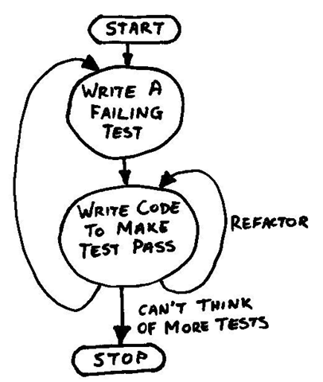

!SLIDE subsection
# Test-Driven Development #
## (TDD) ##

!SLIDE

## TDD is a structured method for writing code that involves automated testing ##

!SLIDE 

## First, let's talk about testing ##

!SLIDE

## __Testing__ is when you systematically verify your code behaves like you expect ##

!SLIDE

## Again, this is something you may have done before... ##

!SLIDE code
    @@@python
    def sum_from_array(num_array):
      #print len(num_array)
      sum = 0
      for line in num_array:
        #print line[0] # double check input
        sum = sum + line[0]
      return sum    

!SLIDE

## __Automated Testing__ is when you write code to do this for you. ##

!SLIDE code
    @@@python
    """Summation method"""
    def sum_from_array(num_array):
      sum = 0
      for line in num_array:
        sum = sum + line[0]
      return sum
        
    """Automated Test"""
    class TestMyMethods(unittest.TestCase)
      def test_sum_from_array(self):
        num_array = [[1],[1]]
        result = sum_from_array(num_array)
        expected = 2
        self.assertEqual(result,expected)
   
!SLIDE bullets
# Basic Test Structure
* provide a known input
* explicitly state your expectation for the output
* compare your expected output with the function's output
* test method will then return True (passed) or False (not passed)
     
!SLIDE

## __Unit Testing__ is a style of automated testing where you write tests for the smallest chunks of code you can. ##

!SLIDE

## Since the smallest __units__ of the code are tested, you gain a certain confidence about the overall behavior of your program. ##

!SLIDE

# How This Makes Your Code Better #

!SLIDE

# Enter TDD #
## (finally) ##

!SLIDE

## TDD is an iterative process where you write tests as you write your code.##

!SLIDE

## In fact, you start writing your tests _before_ you write your code.##

!SLIDE center
## TDD Workflow ##

!SLIDE bullets
# Advantages #
* Makes you think before you write code.
* Helps build a full-suite of tests from the beginning (writing tests after the fact sucks).
* Refactoring or changing your code becomes much easier.
* Makes you write code that is easily tested.

!SLIDE

#  Makes you write code that is easily tested? #
## (So? Isn't this a tautology?) ##

!SLIDE

# No #

!SLIDE bullets

# Think about it: easily tested code tends to be: #
* Small
* Encapsulated
* Object-Oriented
* Singularly-purposed

!SLIDE

# These are _great_ code practices #

!SLIDE

## Also, having a suite of tests acts as a form of documentation ##

!SLIDE code
    @@@python
    class FindBandMinimaTest(unittest.TestCase):
      def test_object_init_accepts_x_and_y_data(self):
        xcol = (1,2,3,4,6)
        ycol = (1,3,2,5,5)
        fbm = FindBandMinima(xcol,ycol)
        self.assertEqual(xcol,fbm.xdata)
        self.assertEqual(ycol,fbm.ydata)

      def test_init_rejects_non_list_input(self):
        self.assertRaises(TypeError,FindBandMinima,3,'string')

      def test_init_turns_lists_into_tuples(self):
        xcol = [1,2,3,4,6]
        ycol = [1,3,2,5,5]
        fbm = FindBandMinima(xcol,ycol)
        self.assertEqual(tuple(xcol),fbm.xdata)
        self.assertEqual(tuple(ycol),fbm.ydata)

!SLIDE 
# With TDD you write better code _as a consequence of making things easier on yourself_. #

!SLIDE

# It's actually really great.

!SLIDE

## But wait, if I'm writing code to test my code, how do I know my test code works? ##

!SLIDE

## We use established test frameworks. ##

!SLIDE bullets
# Every Major Language Has Them #
* Python: UnitTest
* Ruby: Test/Unit
* Java: JUnit
* IDL: MGUnit
* PHP: PHPUnit

!SLIDE bullets

# Test Frameworks Give You a Suite of Functions to Use #
* equality testing
* assert truth
* assert error
* and many more!

!SLIDE
## The framework handles the process of running your tests and returning the results ##

!SLIDE commandline incremental
## Tests are run from the command line ##
  
    $python test_my_methods.py
    ....
    ----------------------------------------------------------------------
    Ran 4 tests in 0.001s

!SLIDE

## The dots mean a test was executed and returned True ##

!SLIDE

## You can write tests for your existing code ##

!SLIDE

## If it's hard to write a test for your code, that usually means your code is bad. ##
### (sorry) ###

!SLIDE

## This means you should consider refactoring your code to make it easier to test. ##
### You'll be glad you did. ###